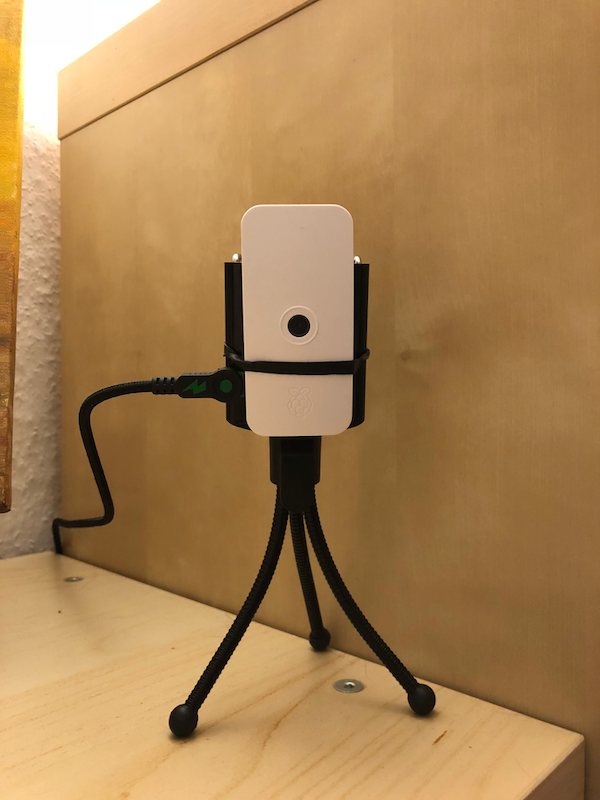

# Installing Homebridge on a Raspberry Pi

This is a short howto to setup a Raspberry Pi (3) as a Homebridge server with camera module for Apple Homekit. However, this also works with older models without built-in wifi.

## Preparing the Pi

- Download [Raspbian Stretch Image](https://downloads.raspberrypi.org/raspbian_lite_latest)
- Open image to access root file system. On a Mac it's just double clicking it
- Create an empty file with ```touch ssh``` to enable ssh per default. On a Mac open a terminal and ```cd /Volumes/boot```
- Flash to an SD card with e.g. [Etcher](https://etcher.io/)
- Start the Pi and locate it on the network. I use [Angry IP Scanner](https://angryip.org/) to find it, it's name should be "raspberrypi"
- ssh to the Pi with ```ssh hostNameOrIpAddress -l pi```
- the password for user pi is ```raspberry```

## Configuring the Pi

- start the configuration with ```sudo raspi-config```
- set up hostname, wifi, locale and keyboard layout, expand the filesystem, enable the camera module etc.
- reboot

## System updates

Issue a

```plaintext
sudo apt update && apt upgrade -y
```

to update the whole system first.

## Other machine settings

Set up a real root user.

```plaintext
sudo passwd
```

Also, you may want to set ssh access for the root user. Open the ```/etc/ssh/sshd_config``` file and search for the line

```plaintext
#PermitRootLogin prohibit-password
```

Change this to

```plaintext
PermitRootLogin yes #prohibit-password
```

Reboot the Pi or restart ssh with

```plaintext
sudo /etc/init.d/ssh restart
```

## Installing Node.js

### Raspberry Pi 2/3 B (+)

Add Node.js to the package list

```plaintext
curl -sL https://deb.nodesource.com/setup_10.x | sudo -E bash -
```

Install Node.js and other packages. We need ffmeg only if we want to use a Pi camera. The installation may take a while.

```plaintext
sudo apt install nodejs node-semver -y
```

### Raspberry Pi Zero W



For the Pi Zero W you cannot use predefined packages. Just download the dist package for ARMv6 architecture from [https://nodejs.org/en/download/](https://nodejs.org/en/download/)

Then unpack the archive with

```plaintext
tar xvf <yourNodeFile.tar>
```

Copy all the files to your binary folder (it's in the $PATH automatically)

```plaintext
cp -r node.../* /usr/local
```

Check if node is found with

```plaintext
node -v
```

## Video codec

For the camera you have to install the codec package:

```plaintext
sudo apt install ffmpeg -y
```

## Install Node.js packages

This will install all relevant node modules.

```plaintext
npm install -g --unsafe-perm pm2 homebridge homebridge-config-ui-x homebridge-camera-rpi homebridge-camera-ffmpeg
```

Set some rights for camera access

```plaintext
usermod -aG video pi && usermod -aG video root
```

If you want to use the Pi camera, add this video module codec to modules at startup

```plaintext
echo bcm2835-v4l2 >> /etc/modules
```

## Config file

My config file is located in ```/root/.homebridge/config.json```

If you don't have that folder and file yet, create them (all commands as root user)

```plaintext
cd
mkdir .homebridge
nano .homebridge/config.json
```

And this is the content in my case. You may want to alter it depending on the plugins and devices you are using.

```json
{
    "bridge": {
        "name": "Bridge_IPCAM",
        "username": "CC:22:3D:E3:CE:30",
        "port": 51826,
        "pin": "656-92-987"
    },
    "description": "This is the description",
    "platforms": [
        {
            "platform": "rpi-camera",
            "cameras": [
                {
                    "name": "Pi Camera"
                }
            ]
        },
        {
            "platform": "config",
            "name": "Config",
            "port": 8083,
            "log": "/var/log/homebridge.stdout.log",
            "error_log": "/var/log/homebridge.stderr.log",
            "restart": "/usr/local/bin/supervisorctl restart homebridge"
        }
    ],
    "accessories": []
}
```

### The Hue plugin

The Philips Hue plugin is to control Osram Smart plugs that you added to the Hue system before. In my case it's just a plug that can be operated without using the Osram bridge by just adding it to the latest version of the Hue bridge. The users property in the config file is usually not predefined. Once you start homebridge on the command line (see chapter test installation) you will see a prompt to press the button on the bridge. This then will create a new user whose credentials the plugin will print out on the homebridge log in the console. Note down those credentials and place it in your config file.

## Test installation

```plaintext
homebridge
```

If no errors occur then congrats! You can stop the script with ```CTRL+C```

If you get errors then please Google them ;-)

## Add homebridge as a service at boot

I am using pm2 to startup node scripts at boot time

```plaintext
pm2 start homebridge
```

Alternatively you can start homebridge in the so called "insecure" mode which allows you to control the devices over the web UI. I don't know what's insecure about that, but hey, you can decide. In this case the command is

```plaintext
pm2 start "homebridge -I"
```

To list the processes that pm2 is running type

```plaintext
pm2 ls
```

To save the pm2 config type

```plaintext
pm2 save
```

To add pm2 to the start up procedure type

```plaintext
pm2 startup
```

## Reboot and check

After reboot check if the server is running by opening ```http://hostname:8083```. This will bring up the config UI. To login use "admin" as username and password. You can change the password later in the UI.

## Troubleshooting

Whenever you experiment with adding and removing the homebridge to your Homekit system, it may occur that you cannot re-add the homebridge after you removed (for testing). In this case change the username property in the config file.

In my case I could successfully re-add the bridge after changing this line:

```plaintext
"username": "CC:22:3D:E3:CE:30"
```

to

```plaintext
"username": "CC:22:3D:E3:CE:31"
```

in the config.json file. It seems that homekit chaches devices for a while so this is a roundtrip.
